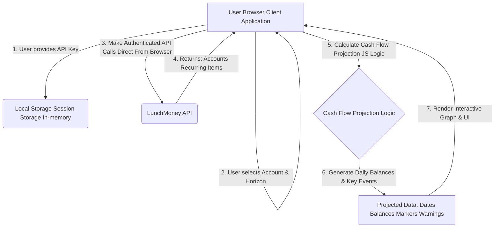

# Technical Design Document: LunchMoney Cash Flow Projector (Client-Side Web App)

## 1. Introduction

This document outlines the technical design for a client-side web application that provides users with a forward-looking cash flow projection for a selected financial account using the LunchMoney API. The application will run entirely in the user's browser, with no dedicated backend server.

**Core Principle:** This application operates on the "Bring Your Own Key" (BYOK) model. The user's LunchMoney API key is never transmitted to or stored on any external server controlled by this application's developer. All API calls are made directly from the user's browser to the LunchMoney API.

## 2. Feature Overview

The Cash Flow Projector will offer the following core functionalities:

* **User-Provided API Key Input:** Users will be prompted to directly enter their personal LunchMoney API key to initiate data fetching.
* **Account Selection:** Users will select a specific liquid asset account (e.g., Checking, Savings) from their LunchMoney data for projection.
* **Projection Horizon:** Users will define the duration of the projection (e.g., 1, 3, 6, or 12 months).
* **Interactive Balance Graph:** A visual representation of the projected account balance over time.
    * The graph will clearly show the current balance as the starting point.
    * It will display the predicted balance on a daily or weekly granularity, updating as transactions are projected.
* **Key Event Markers:** Important dates with significant projected inflows or outflows (e.g., paychecks, large bills, recurring transfers) will be highlighted on the graph and listed separately.
* **Negative Balance Alerts:** Visual warnings and explicit alerts will be displayed if the projected balance is expected to drop below zero (or a user-defined threshold) at any point.
* **Dependency on LunchMoney Recurring Items:** The projection will heavily rely on accurately configured recurring items within LunchMoney to represent future known income and expenses.
* **Credit Card Payment Handling:** The projection will rely on user-defined recurring *transfers* from the projected account to cover credit card payments, treating them as fixed outflows based on the recurring item's value. This acknowledges the difficulty of dynamically predicting variable credit card payments.

## 3. Architecture

The application will be a Single Page Application (SPA) running entirely in the user's browser. All logic for fetching data, calculating projections, and rendering the UI will reside client-side.



*Note: In a standard Markdown environment that supports Mermaid, the above block starting with `graph TD` would be enclosed in ````mermaid` and ```` to render as a diagram.*

### 3.1. Frontend Technology Stack (Example)

* **Framework:** React (or Vue, Svelte, plain JavaScript with a build tool like Vite/Webpack). React is a good choice for modularity and component-based UI.
* **HTTP Client:** `fetch` API (built-in browser API) or `axios` library for making HTTP requests to LunchMoney API.
* **Date/Time Handling:** `date-fns` (lightweight and modular) or `Luxon` for date manipulation and `rrule-alt` for parsing iCalendar recurrence rules.
* **Charting Library:** `Chart.js` (simple, versatile for line graphs) or `Recharts` (React-specific, more declarative).
* **UI Components:** A UI library like Chakra UI, Material-UI, or Ant Design can accelerate development and provide a polished look.

## 4. Data Sources (LunchMoney API Endpoints)

All data will be directly fetched from the LunchMoney API.

* `GET https://dev.lunchmoney.app/v1/assets`
    * **Purpose:** Retrieve a list of all user assets (accounts) for selection.
    * **Data Fields Needed:** `id`, `name`, `balance` (current balance), `type` (e.g., 'cash', 'credit').
    * **Filtering:** Primarily project 'cash' type accounts.
* `GET https://dev.lunchmoney.app/v1/recurring_items`
    * **Purpose:** Crucial for projecting future known income and expenses.
    * **Data Fields Needed:** `id`, `amount`, `rrule` (iCalendar RFC 2445 recurrence rule string), `start_date`, `end_date` (optional), `asset_id` (the account associated with this recurring item), `is_income`, `category_id`.
    * **Filtering:** Only recurring items whose `asset_id` matches the selected account's ID and fall within the projection range will be used.
* `GET https://dev.lunchmoney.app/v1/categories` (Optional but recommended for context)
    * **Purpose:** To retrieve category details like `is_income`, which can reinforce the `is_income` flag on recurring items.
    * **Data Fields Needed:** `id`, `name`, `is_income`.

## 5. Core Logic and Algorithm (Client-Side JavaScript)

The cash flow projection algorithm will simulate daily account balances in the browser.

### 5.1. Input Parameters (from UI)

* `lunchmoney_api_key`: Provided by the user.
* `selected_account_id`: ID of the LunchMoney asset account chosen by the user.
* `projection_horizon_months`: Number of months to project (e.g., 1, 3, 6, 12).

### 5.2. Algorithm Steps

1.  **API Key Input & Storage:**
    * User is presented with an input field for their LunchMoney API key.
    * **Recommendation:** Store the API key primarily in **session storage** (`sessionStorage.setItem('lm_api_key', key)`) or directly in a component's **in-memory state**. This ensures the key is cleared when the browser tab/session is closed, providing a level of ephemeral security.
    * **`localStorage` as an Option (with Caution):** If the user desires persistence across sessions, `localStorage` can be an *option*, but it **must** be accompanied by a prominent and explicit warning to the user about the inherent security risks (e.g., vulnerability to XSS attacks, potential for malicious browser extensions to access it). The user should understand that by storing it persistently, they are assuming this risk.
    * The application should clearly state that the key is used locally in their browser for direct communication with LunchMoney's API and is not sent to any external servers controlled by this application.
2.  **Initial Data Fetch:**
    * Using the provided `lunchmoney_api_key`, make concurrent `fetch` requests to:
        * `GET /v1/assets` to get all accounts and their current balances.
        * `GET /v1/recurring_items` to get all recurring transactions.
    * Include the API key in the `Authorization: Bearer YOUR_ACCESS_TOKEN` header.
    * Handle any API errors (e.g., invalid token, network issues) gracefully and display appropriate messages to the user.
3.  **Initialization:**
    * Identify the `selected_account` from the fetched assets based on `selected_account_id`. Get its `current_balance`.
    * Set `projection_start_date` to `today()` (which is July 7, 2025).
    * Calculate `projection_end_date` as `projection_start_date + projection_horizon_months`.
    * Initialize `projected_transactions_events = []`.
    * Initialize `daily_balance_records = []`.
    * Initialize `negative_balance_alerts = []`.
4.  **Filter & Project Recurring Transactions:**
    * Filter the fetched `recurring_items` array:
        * Include only `ri` where `ri.asset_id === selected_account.id`.
        * Ensure `ri.end_date` is null or `ri.end_date >= projection_start_date`.
        * Ensure `ri.start_date <= projection_end_date`.
    * For each filtered `recurring_item` (`ri`):
        * Use `rrule-alt` or similar library to parse `ri.rrule` and generate all `occurrence_date`s within `[projection_start_date, projection_end_date]`.
        * For each `occurrence_date`:
            * Create a `projected_transaction` object:
                ```javascript
                {
                    date: occurrence_date.toISOString().substring(0, 10), //YYYY-MM-DD
                    amount: ri.amount * (ri.is_income ? 1 : -1), // Amount adjusted for income/expense
                    description: ri.payee || 'Recurring Transaction',
                    is_income: ri.is_income,
                    recurring_item_id: ri.id
                }
                ```
            * Add this object to `projected_transactions_events`.
5.  **Sort Projected Transactions:**
    * Sort `projected_transactions_events` array chronologically by `date`.
6.  **Simulate Cash Flow Day-by-Day:**
    * Initialize `current_projected_balance = selected_account.balance`.
    * Initialize `event_index = 0` (to track current position in `projected_transactions_events`).
    * Loop `current_date` from `projection_start_date` to `projection_end_date` (inclusive):
        * Add `{'date': current_date.toISOString().substring(0, 10), 'balance': current_projected_balance}` to `daily_balance_records`.
        * **Apply Transactions for `current_date`:**
            * While `event_index < projected_transactions_events.length` and `projected_transactions_events[event_index].date === current_date.toISOString().substring(0, 10)`:
                * `transaction = projected_transactions_events[event_index]`
                * `current_projected_balance += transaction.amount`
                * If `current_projected_balance < 0` (or below a user-defined threshold):
                    * Add an alert to `negative_balance_alerts`:
                        ```javascript
                        {
                            date: current_date.toISOString().substring(0, 10),
                            balance_after_transaction: current_projected_balance,
                            triggering_transaction: transaction
                        }
                        ```
                * `event_index++`
7.  **Output for UI:**
    * Return `daily_balance_records`, `projected_transactions_events`, and `negative_balance_alerts` to the React component (or equivalent) for rendering.

## 7. API Interaction Details & Security

* **API Endpoint:** `https://dev.lunchmoney.app/v1/...`
* **Authentication:**
    * Requests will use the `Authorization: Bearer YOUR_ACCESS_TOKEN` header.
    * The `YOUR_ACCESS_TOKEN` is provided by the user and *remains on their machine*.
* **Security for Client-Side API Key Handling (Crucial Considerations):**
    * **No Server-Side Storage:** The API key is explicitly *not* sent to or stored on any server related to this application. This is a fundamental security choice.
    * **User Responsibility:** The user assumes the responsibility for the security of their browser environment. They are trusting that their browser is not compromised by malware or malicious extensions that could intercept data or local storage.
    * **Ephemeral Storage (Recommended):** The primary recommendation is to store the API key only in `sessionStorage` or in-memory state. This means the user will re-enter the key each time they open a new tab/session. This is the safest client-side approach.
    * **Persistent Storage (with Extreme Caution):** If persistent storage (`localStorage`) is offered as an option for user convenience, it *must* come with:
        * A prominent, clear, and unmissable warning about the security implications (e.g., "Storing your API key locally can expose it to malicious browser extensions or XSS attacks. Only do this if you understand and accept the risk.").
        * A strong suggestion for users to revoke their LunchMoney API key if they suspect their browser or device has been compromised.
    * **HTTPS Only:** The application *must* be served over HTTPS to protect the API key and financial data in transit between the user's browser and the LunchMoney API.
    * **CORS:** LunchMoney's API should have appropriate CORS (Cross-Origin Resource Sharing) headers configured to allow requests from your client-side application's origin. This is usually handled by the API provider.
    * **User Education:** Clearly explain to the user:
        * The purpose of the API key.
        * Why it's required for the app to function.
        * How the key is handled (e.g., "Your key is used directly from your browser to communicate with LunchMoney's servers. It is not sent to our servers and is only stored temporarily in your browser session.").
        * The inherent risks of client-side key exposure (even if minimal for read-only keys) and the importance of browser security.

## 8. User Interface (Conceptual Mockup)
---

```
+-------------------------------------------------------------------+
| LunchMoney Cash Flow Projector                                    |
+-------------------------------------------------------------------+
|                                                                   |
|   [TEXT INPUT] Your LunchMoney API Key: [                        ]
|   [BUTTON] Save Key (Session Only) [BUTTON] Clear Key
|   [ALERT ICON] Important Security Note: Your API key is used |
|   directly by your browser to fetch your LunchMoney data. It is   |
|   not sent to any external servers. For security, it is         |
|   recommended to store it only temporarily in your browser        |
|   session (cleared on tab close). Be aware of the risks if you    |
|   choose persistent storage.                                      |
|                                                                   |
+-------------------------------------------------------------------+
| Selected Account: [Dropdown: Checking ▼]                          |
| Projection Horizon: [Dropdown: 3 Months ▼]  [Generate Projection] |
+-------------------------------------------------------------------+
|                                                                   |
|   [Loading Spinner] (while fetching data / calculating)           |
|                                                                   |
|   ^ Balance ($)                                                   |
|   |                                                               |
|   |      .-------.                                                |
|   |     /         \           (Paycheck)                          |
|   |    /           o--------------------                         |
|   |   o                                                           |
|   +---|-------------------o-------------------o------------------> Date
|       Jul 7, 2025    Mid-Jul 2025    Early Aug 2025    Mid-Aug 2025
|                                                                   |
|   --------------------------------------------------------------  |
|   [ALERT ICON] Predicted Negative Balance: Aug 10, 2025 (-$150)   |
|   Action Needed: Consider adjusting spending or timing.       |
|   --------------------------------------------------------------  |
|                                                                   |
| KEY EVENTS:                                                       |
|   - Jul 15: Paycheck ($2500)                                      |
|   - Jul 20: Rent Payment ($1200)                                  |
|   - Aug 10: Utility Bill ($150) - Potential Negative Balance! |
|   - Aug 15: Paycheck ($2500)                                      |
+-------------------------------------------------------------------+
```

## 9. Development Workflow
---
1.  **Project Setup:** Initialize a new React (or your chosen framework) project using a tool like Vite or Create React App.
2.  **UI Components:** Build the fundamental user interface elements such as the API key input, account dropdowns, horizon selection, buttons, loading states, and interactive warning messages.
3.  **API Client Module:** Create a dedicated JavaScript module responsible for making authenticated `fetch` calls directly to the LunchMoney API. This module will accept and utilize the user-provided API key.
4.  **Cash Flow Logic Module:** Implement the core projection algorithm in a separate, pure JavaScript module. This module will take the raw API data and process it into the structured projection data.
5.  **Integration:** Connect the UI components to the API client and the cash flow projection logic. Utilize state management (e.g., React's `useState` and `useEffect` hooks, or a context API) to efficiently manage data flow throughout the application.
6.  **Charting Integration:** Integrate your chosen charting library (e.g., Chart.js) to visually present the `daily_balance_records` and mark `key_events` on the graph.
7.  **Error Handling & Feedback:** Implement robust error boundaries and user feedback mechanisms for various scenarios, including API errors, calculation errors, and security warnings.
8.  **Deployment:** Deploy the application as static files to a hosting service such as Netlify, Vercel, GitHub Pages, or any standard web server. **Ensure HTTPS is enabled for secure communication.**

---
* **Rate Limiting:** Implement client-side debounce/throttle for API calls, and provide user feedback if LunchMoney's rate limits (`429 Too Many Requests`) are encountered.
* **Error Handling:** Implement robust error handling for `fetch` calls, catching network errors, invalid API token errors (`401`), and other HTTP errors. Display informative messages to the user.

## 8. User Interface (Conceptual Mockup)