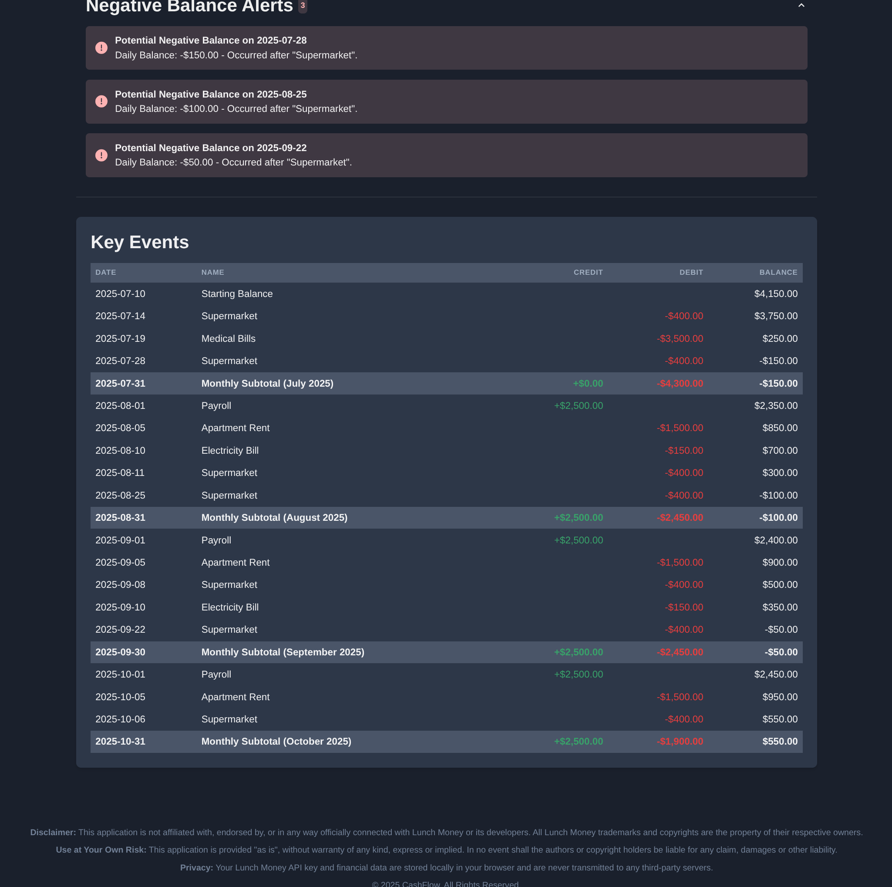

# CashFlow App

## Overview

The CashFlow App is a web-based tool designed to help users visualize and project their financial cash flow. By integrating with Lunch Money API, it provides an interactive chart to display income, expenses, and future balance projections, helping users make informed financial decisions.

Here are some screenshots of the application in action:



## Features

- **Interactive Cash Flow Chart**: Visualize your financial trajectory with a dynamic and customizable chart.
- **Projection Horizon Selection**: Adjust the time horizon for your cash flow projections.
- **Key Events Tracking**: Incorporate significant financial events into your projections.
- **Negative Balance Alerts**: Receive timely alerts for potential negative balances.
- **API Key Management**: Securely manage your API keys for financial service integrations.

## Getting Started

To get a local copy up and running, follow these simple steps.

### Prerequisites

Ensure you have Node.js and npm (or yarn) installed on your system.

### Installation

1. Clone the repository:
   ```bash
   git clone https://github.com/WesleyCeraso/cashflow-app.git
   ```
2. Navigate to the project directory:
   ```bash
   cd cashflow-app
   ```
3. Install dependencies:
   ```bash
   npm install
   # or yarn install
   ```

### Running the Application

To start the development server:

```bash
npm run dev
# or yarn dev
```

The application will typically be available at `http://localhost:5173`.

### Building for Production

To build the application for production:

```bash
npm run build
# or yarn build
```

This will create a `dist` directory with the production-ready files.

## Usage

Upon launching the application, you will be prompted to enter your API key for financial data integration. Once configured, you can select accounts, adjust projection settings, and view your cash flow projections.

## Contributing

Contributions are what make the open-source community such an amazing place to learn, inspire, and create. Any contributions you make are **greatly appreciated**.

1. Fork the Project
2. Create your Feature Branch (`git checkout -b feature/AmazingFeature`)
3. Commit your Changes (`git commit -m 'Add some AmazingFeature'`)
4. Push to the Branch (`git push origin feature/AmazingFeature`)
5. Open a Pull Request

## License

Distributed under the MIT License. See `LICENSE` for more information.

## Contact

Project Link: [https://github.com/WesleyCeraso/cashflow-app](https://github.com/WesleyCeraso/cashflow-app)